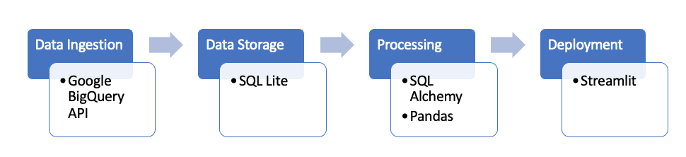
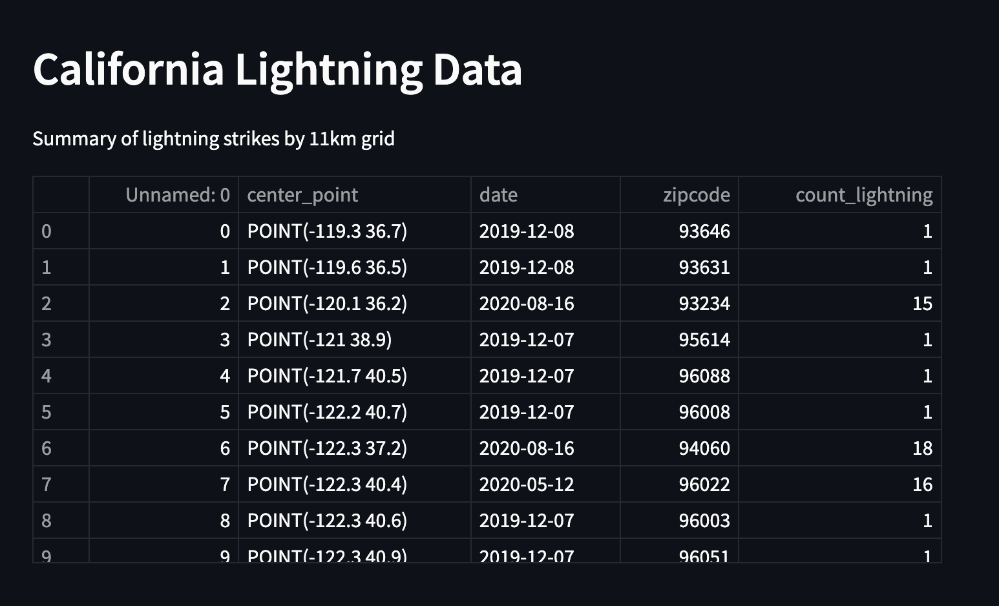

## Understanding Lightning Strike Data for California
 

My project idea has been refined to only include California data - the area of highest economic wildfire risk, for years from 1987 to 2020 (the most recent dataset). 

The pipeline remains unchanged and includes:

 

After creating the pipeline for data acquisition and preprocessing, I deployed a summary using Streamlit:

https://share.streamlit.io/amyyunekim/course_3_dataengineering/main

 

### Further steps:

Improve pipeline:
- Formatting data properly for Streamlit
- Think about what summaries I want for the final app, and produce appropriate aggregations
- How can the pipeline be improved more generally? 

App improvement:
- Include interactive mapping and graphs
- Find vegetation basemap to show a view of wildfire risk

Incorporate Testing: 
- Make sure data ingestion is robust against erroneous data. Build data quality checks
- Are datapoints correct and fall within an expected range?
- Is web app stable? Have users try to break it & potentially build in error handling.

Stretch goal: 
- Include predictive time series model..?
