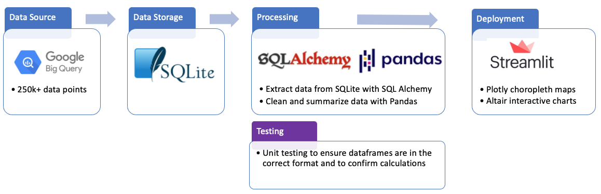

# Data Engineering Project Write up

## Understanding Lightning Strike Data in California

### Abstract:

The goal of this project was to create a data storage and processing pipeline to create an app to vizualise lightning data in California, an area of high wildfire risk. The data set was sourced from Google BigQuery public data, which was imported into SQLite database for storage. The data was brought into python and pandas was used to clean and process data into dataframes for Streamlit vizualisations, including a choropleth map and dynamic barchart of lightning strikes over time, and summary stats per zipcodes.

### Design: 

The pipeline was constructed as shown in the pipeline diagram below:

The final streamlit app showed 3 different visuals. 
1. A choropleth map which shows lightning strikes per zipcode with a year slider.
2. Basics statistics on number of strikes a year per zipcode including average, min, max and standard deviation.
3. An interactive barchart with a zipcode filter to vizualise the daily strikes over 1987 - 2020.

### Data:
The lightning data was taken from Google's BigQuery public data [website](https://console.cloud.google.com/marketplace/product/noaa-public/lightning?project=data-engineering-345807). It includes lightning strike information which is aggregated into 11km tiles with the center point for each tile. The lightning data was joined onto another BigQuery dataset that defines the polygon of zipcode areas to determine the most frequently hit zipcodes. 
The resulting data was filtered down to years 1987 - 2020 for California only. The final dataframe included 283,465 rows of data, which was was transformed into various aggregations to feed into the streamlit visualizations.

Shapefiles for the choropleth mapping were sourced from this github [repository](https://github.com/OpenDataDE/State-zip-code-GeoJSON/) and reduced for faster loading in streamlit.

### Tools:
- BigQuery API for data extraction 
- SQLite for data storage
- SQLAlchemy for writing/reading data from SQL database
- Pandas and NumPy for data manipulation  
- Json and Shapely for mapping features
- Unittest for unit testing
- Plotly and Altair for interactive graphs and maps within Streamlit
- Streamlit for app deployment

### Final dashboard:

The app can be accessed on Streamlit at : https://share.streamlit.io/amyyunekim/course_3_dataengineering/main
